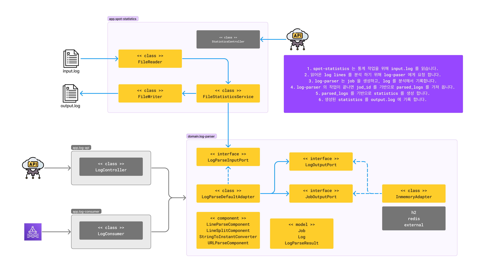

## 확장 개발을 고려한 아키텍처 설계

### spot-statistics 모듈

- log-parser 에게 문자열을 분석 시키는 역할과 그 결과를 통계로 작성하는 역할을 합니다.

### log-parser 모듈

- 입력된 문자열에 대해 로그 형태로 분석하고 기록하는 역할을 합니다.
- component 의 추가 개발과 조합을 통해 다양한 문자열 형태에 대응할 수 있습니다.
- LogOutputPort 의 추가 개발로 분석된 로그의 저장 공간을 변경할 수 있습니다.

## 요건에는 없지만 더 고려한 부분

### 문자열 분석과 통계 생성을 분리하기 위해 저장 공간을 구현

- `log-parser` 는 문자열 분석이 들어오면 job 을 만들고 저장의 역할만 수행 합니다.
    - 결과 통계에는 없지만 query, request_time 도 기록되고 있습니다.
    - 로그의 패턴이 불량하거나, status_code 가 200이 아닌 경우에 대해서도 기록 됩니다.
- 로그 저장시 한개씩 저장하는 것이 아닌 bulk 저장을 구현 하였습니다.

### stateless 한 객체로 구현

- `spot-statistics` 는 singleton 은 아니지만, spring application context 와 유사한 방법으로 객체를 관리 합니다.

### 자의적으로 해석한 부분 1 - request_time 의 zone 이 명시되어 있지 않음

- request_time 의 요구 조건에는 zone 이 명시되어 있지 않아, UTC 로 해석하여 구현 했습니다.
- 따라서 파일과 서버 모두 UTC 로 해석하여 구현 하였습니다.
- 만약 입력 파일이 다른 zone 으로 들어온다면 구현체에 zone 을 주입하여 변경할 수 있습니다.
    - StringToInstantConverter

### 자의적으로 해석한 부분 2 - 출력 포맷 설명에서 호출/요청 회수의 차이

> 호출 횟수는 상태코드가 200으로 정상인 경우에만 카운트 해야함.

- API_KEY 와 웹브라우저는 호출 횟수로, API Service ID 는 요청 횟수를 카운트하라고 명시되어 있습니다.
- 하지만 input.log 를 해석해볼 때 Api Service Id 가 명시되지 않는 경우가 많아 null 로 처리하는 것은 힘들었습니다.
- 따라서 url 패턴이 정상이 아닌 경우 개발 요건에는 없지만 기본 값을 넣도록 구현 했습니다.
    - log line 분석 단계에서 LineParseException 이 발생하면 작동 합니다.
    - ApiServiceId.UNKNOWN, WebBrowser.UNKNOWN

## 향후 개선에 대한 생각

> 업무 요건이 로그 분석이기 때문에 예시의 5000 line 보다 매우 많은 경우 최적화가 필요할 수 있습니다.
>
> 하지만 비즈니스의 개발에서는 아직 요건이 오지 않은 성능보다는,  
> 기본 업무 요건을 만족하고 지속적인 업무 변경을 동료와 함께 할 수 있는 것이 더 중요하다고 생각합니다.  
> 따라서 현재는 보편적인 설계와 병목 구간을 분리하고 테스트 코드를 작성하는 수준으로 하였습니다.

### 한번에 처리하기 힘든 큰 파일이 들어오는 경우

- 이미 job 이 나누어져 있기에 파일이 큰 경우 청크를 나눌 수 있습니다.
- 해당 job 을 진행 상태로 두고 청크를 처리하면서, 마지막에 job 을 종료할 수 있습니다.
- job_id 는 먼저 반환하고 비동기로 처리하거나 콜백을 주는 방법도 있습니다.

### 로그 분석 요청이 실시간으로 들어오는 경우

- 로그 분석에 있어 실무라면 파일 단위보다는 실시간으로 들어오는 경우가 더 일반적일 것 같습니다.
- 이 때는 앞에 큐를 두고 실시간으로 처리할 수 있습니다. webflux 등을 사용할 수도 있습니다.
- 통계로 내는 부분은 job 의 종료를 기반할 수도 있고, time_range 를 기반할 수도 있습니다.

### 로그 저장의 성능 개선, 또는 교체

- 본 과제에서는 설계와 구현 능력을 어필하기 위해 inmemory database 를 직접 구현 하였습니다.
- 하지만 실무라면 서버 내에 구성할지라도 testcontainer 등을 활용하여 경량 db 를 구현할 수 있습니다.
    - 외부 연동으로 변경할 수도 있습니다.
- 만약 로그 분석이기에 추이가 중요하고 유실을 허용할 수 있다면 metric, redis hyperloglog 등을 활용할 수도 있습니다.
